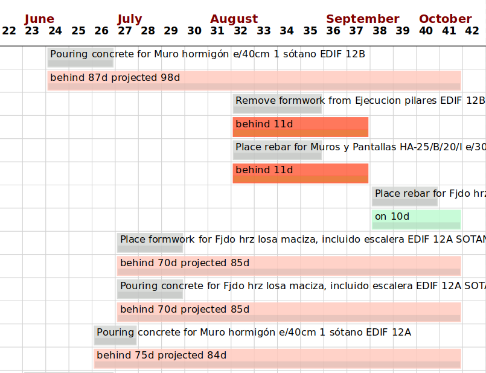

# BIM2TWIN WP3 Progress Monitoring

This repo consist of scripts to create as-performed nodes like `action`, `operation` and `construction` in BIM2TWIN DTP
and perform progress monitering at activity level.

Set your `DEV_TOKEN`, `DTP_DOMAIN` and `LOG_DIR` in `DTP_API/DTP_config.xml`

## Create as-performed node

> **Warning**
> This script creates/modifies multiple nodes in the DTP.

The script will create as-performed nodes except as-performed elements. This script need to be run to create or update
nodes as new data scans are introduced to the DTP. The result of this script will directly influence progress
monitering.

```shell
python3 create_asperformed.py
```

The above script ignores nodes if the node already exist in the graph. But you have an option to force update node
with `--force_update`. If this flag is set, nodes will be updated even if the node already exist in the graph.

## Progress monitor


This script run progress monitering at activity level with DTP.

```shell
python3 progress_monitoring.py
```

The above script take around 1 min to fetch all nodes from the node, thus the below script include faster (1-2 secs)
fetching and progress monitoring calculations.

```shell
python3 progress_monitoring_v2.py
```

## Delete as-performed node

> **Warning**
> This script deletes multiple nodes in the DTP.

The below command will delete all `construction`, `operation` and `action` nodes

```shell
python3 delete_asperformed.py --target_level 'all'
```

## Output

The result is visualized as a Gantt chart. The graphical representation utilizes two horizontal bars per activity, with
a grey bar indicating the planned schedule and a colored bar representing the actual performance. Dark red signifies
completed but delayed activities, while dark green denotes activities on schedule but still need to be completed. Light
red indicates activities behind schedule and not initiated, and light green signifies on-schedule activities yet to
commence. The overlaid text provides details such as activity name, progress status, days ahead/behind schedule, and
projected completion time.

