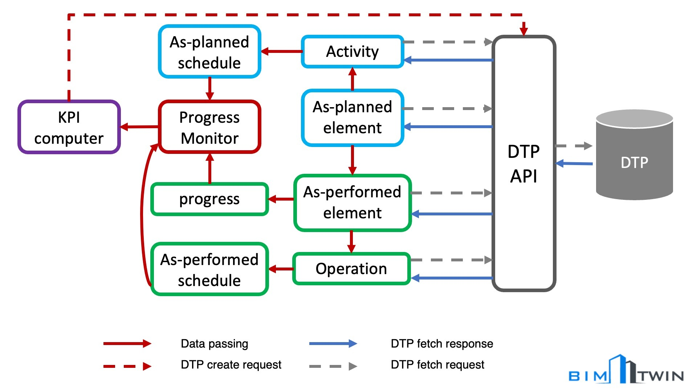

# BIM2TWIN WP3 Progress Monitoring

This repo consist of scripts to create as-performed nodes like `action`, `operation` and `construction` in BIM2TWIN DTP
and perform progress monitering at activity level.

## Create as-performed node

The script will create as-performed nodes except as-performed elements. This script need to be run to create or update
nodes as new data scans are introduced to the DTP. The result of this script will directly influence progress
monitering.

```shell
python3 create_asperformed.py --log_dir path/to/session_log/dir
```

The above script ignores nodes if the node already exist in the graph. But you have an option to force update node
with `--force_update_asperf`. If this flag is set, nodes will be updated even if the node exist in the graph already.

> **Warning**
> Handle this script carefully as it create new or update nodes in the DTP. You could revert this event with session log
> files.

## Progress monitor



This script run progress monitering at activity level with DTP.

```shell
python3 progress_monitoring.py
```